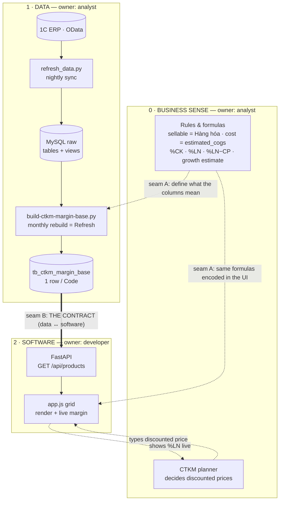

# Promo Margin Planner — Architecture (how to reason about it)

Three lenses, on purpose: **why it exists → where the numbers come from → what the code does when.**

## Overview — the 3 layers and the seams between them



**Read it as two seams you own:**
- **Seam A — Business ↔ Data.** Your rules decide *what the numbers mean* (what counts as sellable, what "cost" is, which formulas). This shapes the build script's columns **and** the UI formulas. Change a rule → you touch both, on purpose.
- **Seam B — Data ↔ Software.** `tb_ctkm_margin_base` + `/api/products` is the hand-off. As long as its shape holds, the developer can rebuild the whole app and you never notice; you can re-source a column and they never notice.

The **human loop** closes it: the planner (business) drives the software and reads the margin back. Keep those two seams stable and each layer is independently controllable — that's the whole game.

---

## 0. Business sense

**Problem.** Every month the team runs a promotion campaign (CTKM). For each product they must decide a **discounted price per sales channel** and know whether that price still makes money. Historically this was a manual Excel sheet (`CTKM T5`) where the margin numbers were pasted by hand and often stale/wrong.

**What this tool does.** A web grid where a **planner types the discounted price** for each channel and instantly sees the **gross margin (%LN)** — computed from real inventory, recent sales, list price and estimated cost pulled from the 1C system.

**Who uses it.** CTKM planners (internal). Read-only against the data warehouse; the only thing they *enter* is the promotion price (and a few overrides/notes).

**Channels priced** (each: giá sau giảm → %CK → %LN):
- B2C: **Web + Showroom**, **Ecom (sàn)** — Ecom also carries a platform fee → **%LN sau CP**.
- B2B: **Đại lý mức 1**, **Đại lý mức 2**.

**Core formulas**
- `%CK  = 1 − giá sau giảm ÷ giá niêm yết`
- `%LN  = (giá sau giảm − giá vốn) ÷ giá sau giảm`   *(straight, no VAT)*
- `%LN sau CP (Ecom) = (giá sau giảm − giá vốn − phí sàn) ÷ giá sau giảm`,  `phí sàn = giá sau giảm × CP%`
- `Ước tính T+1 = SL tháng gần nhất × (1 + tỉ lệ tăng trưởng)`  (retail & wholesale separately)

**Out of scope (v1):** entered prices are **not saved** (Refresh clears them); no login/roles; no server deployment. Those are the next phase.

---

## 1. Data

### 1.1 Data flow

```mermaid
flowchart LR
  A[1C ERP\nOData] -->|1. refresh_data.py\n(nightly sync)| B[(MySQL kazgevim_1C\nraw tables + views)]
  B -->|build-ctkm-margin-base.py\n(monthly rebuild = "Refresh")| C[(tb_ctkm_margin_base\n1 row per Code)]
  C -->|FastAPI GET /api/products| D[JSON]
  D -->|browser fetch| E[app.js grid\n+ live margin]
  E -.->|planner types price| E
```

**Two systems, one hand-off table.**
- The **sync repo `1c-data-sync`** owns everything up to and including `tb_ctkm_margin_base`. This web app **does not build data** — it only reads that one table.
- **`tb_ctkm_margin_base`** = the contract. One row per product **Code** (product + màu; sizes merged), Hàng-hóa only.

**Where each column comes from** (built by `build-ctkm-margin-base.py`):

| Column | Source |
|---|---|
| code, color, sku | `ItemsCharacteristics` (code = ItemsCharacteristics.Code) |
| product_desc, sport_desc, **product_type**, group_product, brand_desc, image_src | `vw_sku` (LEFT-joined enrichment) |
| list_price (giá niêm yết) | `vw_sku_retail_price` (Giá bán lẻ, latest) |
| cogs (giá vốn) | `tb_characteristic_estimated_cogs` |
| instock, available, sizes_in_stock | `tb_characteristic_warehouse_inventory` |
| last_receipt_date, months_since_receipt | `GoodsToReceive_RecordType` (last purchase receipt) |
| sold_retail_m1/m2, sold_wholesale_m1/m2 | invoice fact × authoritative channel `vw_grouped_sales_channel_...` (last 2 completed months) |
| month_m1, month_m2 | the two month labels (rolling) |

**"Refresh data" (monthly) = re-run `build-ctkm-margin-base.py`.** It re-clones `Catalog_ItemKinds`, rebuilds the whole table. The app's Refresh button re-fetches; it does **not** rebuild.

---

## 2. Software

Stack: **FastAPI** (thin read layer) + **static HTML/JS** (no build step). Margin math runs **in the browser**.

```
backend/  main.py (routes + serves frontend) · db.py (MySQL connection) · config.py (.env)
frontend/ index.html (layout) · app.js (data + render + compute) · style.css
```

### 2.1 Step by step — which function runs at each point

**A. Server start** — `uvicorn backend.main:app`
- `main.py` builds the FastAPI `app`, mounts `frontend/` at `/`, declares `/api/*` first.

**B. Page load** (browser opens `/`)
1. `index.html` loads → `<script src="/app.js">`.
2. `app.js` runs `load()` at the bottom.
3. `load()` → `fetch("/api/products?limit=10000")`.
4. Backend `main.py::products()` → `db.py::get_connection()` → `SELECT * FROM tb_ctkm_margin_base LIMIT %s` → returns `{count, months, rows}`.
5. `load()` maps each row → `DATA[]` (promo starts empty); sets months via `nextMonth()`; `setHeaders()` writes the month-labelled column headers; fills the Bộ môn `<select>`; calls `render()`.

**C. Render the grid** — `render()`
1. Filter `DATA` by Bộ môn / stock / search.
2. Sort by `sport|type|group|product|code`.
3. Walk rows; when a hierarchy level changes emit `groupRow()` (Sport ▸ Loại ▸ Nhóm ▸ Tên), unless an ancestor is in the `collapsed` set; emit `leafRow()` for each mã·màu.
4. Inject HTML into `#body`; update the count line.
- `pathsOf(d)` builds the 4 hierarchy keys used for grouping/collapse.

**D. One leaf row** — `leafRow(d)` computes and renders:
- Ước tính lẻ/buôn = `r1/w1 × (1 + ratio)` (ratios from toolbar).
- Per channel: `ck()` = %CK, `gm()` = %LN, colored by sign (`gmc()`, `ckc()`).
- Ecom: `phí sàn = giá × rowcp%` (rowcp defaults to the CP toolbar, override per row), `%LN sau CP`.
- Tồn band via `band()` + color class `bandCls()`; thumbnail from `image_src`.

**E. Planner types a promo price** — `#body` `input` listener
- Updates `DATA[i].promo[channel]`, then updates **only that channel's %CK + %LN cells in place** (keeps input focus).
- If channel is Ecom → `recomputeEcomAfter()` recomputes phí sàn + %LN sau CP.
- Editing a row's **Phí sàn %** sets `DATA[i].cp` (per-row override) → `recomputeEcomAfter()`.
- Editing **Ghi chú** stores `DATA[i].note`.

**F. Toolbar changes**
- Bộ môn / stock / search / growth-ratios → `render()` (full re-render).
- **CP Sàn+QC %** → clears every row's `d.cp` override, then `render()` (bulk reset to new default).

**G. Drill-down caret** — `#body` `click` listener → toggle key in `collapsed` → `render()`.
**H. Thu gọn/Mở** button → collapse/expand all → `render()`.
**I. Refresh data** button → confirm → `load()` (re-fetch from DB, entered prices cleared).

### Function index

| Layer | Functions |
|---|---|
| backend/main.py | `health()`, `products(limit)` |
| backend/db.py | `get_connection()` |
| backend/config.py | env vars (DB creds, BASE_TABLE) |
| frontend/app.js — data | `load()` |
| frontend/app.js — render | `render()`, `leafRow()`, `groupRow()`, `pathsOf()`, `setHeaders()`, `nextMonth()` |
| frontend/app.js — compute | `gm()`, `ck()`, `band()`, `bandCls()`, `gmc()`, `ckc()`, `recomputeEcomAfter()`, `vnd()`, `pct()` |
| frontend/app.js — events | body `input`, body `click`, toolbar inputs, `f-cp`, `refresh`, `expand` |
| data contract (other repo) | `build-ctkm-margin-base.py` → `tb_ctkm_margin_base` |

---

*One line to remember: the sync repo makes the numbers (`tb_ctkm_margin_base`), FastAPI hands them over (`/api/products`), and `app.js` renders + computes margin live — the planner only types the price.*
